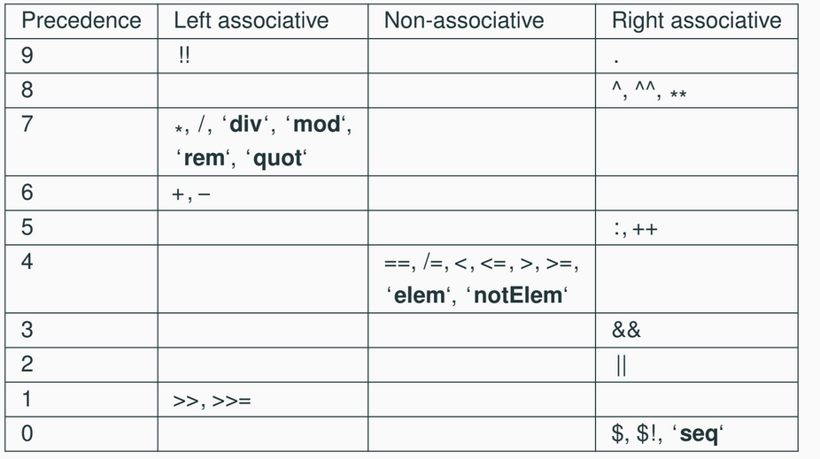
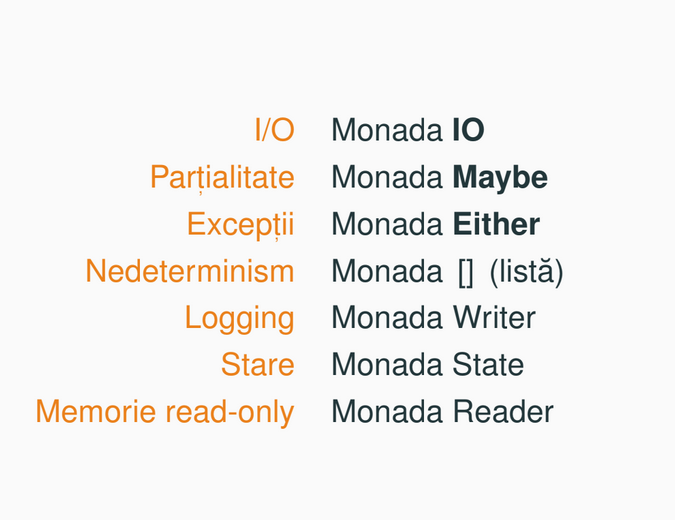

## Types
- Tipurile de baza: Int, Integer, Float, Double, Bool, Char, String
- Tipuri compuse: tupluri si liste
- Tipuri noi definite de utilizator
- În Haskell, ordinea ecuatiilor este importanta (vezi pattern matching cu cazul de baza ultimul)

## Liste
- Intervale si progresii (finite si infinite) cu lazy evaluations
- `[ E(x) | x <− [x1, . . . , xn], P(x) ]`
- `[ ( i , j ) | i <− [ 1 . . 2 ] , let k = 2 * i , j <− [ 1 .. k ] ]`
- head `[]` arunca exceptie

## Operators and sections

- Depending on the associative direction one can use sections for operators
- Sections are operators where one operand is known
- Operatorul `$` are precedenta 0

## High-order functions
- Functiile sunt valori (first-class citizens).
- Functiile pot fi folosite ca argumente pentru alte functii.
- Functii anonime = lambda expresii
- Currying este procedeul prin care o functie cu mai multe argumente este transformata într-o functie care are un singur argument si întoarce o alta functie.
```hs
curry :: ((a, b) −> c) −> a −> b −> c
uncurry :: (a −> b −> c) −> (a, b) −> c
```
- Review map, filter si fold(l/r)
```hs
-- Square the elements on odd positions
sqr_odd_pos :: [Int] -> [Int]
sqr_odd_pos list = map sqr $ map fst $ filter (\(x, y) -> odd y) $ zip list [1..] where sqr x = x * x

-- Sum the squares of positives
sum_sq_pos :: [Int] -> Int
-- sum_sq_pos = sum . map (^ 2) . filter (> 0)
sum_sq_pos = foldr (+) 0 . map (^ 2) . filter (> 0)

-- Convert a list of nums to num
listToInt :: [Int] -> Int
listToInt list = foldl (\num x -> num * 10 + x) 0 list


```
- Limbajul Haskell foloseste implicit evaluarea lenesa:
  - expresiile sunt evaluate numai când este nevoie de valoarea lor
  - expresiile nu sunt evaluate total, elementele care nu sunt
  folosite ramân neevaluate
  - o expresie este evaluata o singura data
- `take 3 $ foldl (\ xs x −> ( x +1) : xs ) [] [ 1 .. ]` se calculeaza la infinit
- `take 3 $ foldr (\ xs x −> ( x +1) : xs ) [] [ 1 .. ]` este chill si da [2, 3, 4]

## Tipur de date algebrice
- `data Bool = False | True`: Bool este constructor de tip (creeaza tipuri de date) si False/True (definesc date) constructor de date
- Pentru ca se pun cu `|` Bool se mai cheama tipuri de date suma
- `data List a = Nil | Cons a (List a)`
- Forma generala a unui constructor de tipuri
```hs
data TypenameClass = Cons_1 t11 . . . t1k1
    | Cons_2 t21 . . . t2k2
    | . . .
    | Cons_n tn1 . . . tnkn
```
- Tipuri des utilizate: `Maybe`, `Either`, `List`

## Records
- Cu `type` / `newtype` se pot redenumi tipuri deja existente: `type FirstName = String`
```hs
data Person = Person {
    age :: Int,
    height :: Float,
    phoneNumber :: String
}

bobitza = { firstName = " Calin "
, lastName= " Georgescu "
, age = 30 , h e i g ht = 192.3
, phoneNumber = " 0798765432 "
}
```

## Clase de tipuri
- Reprezinta clase cu tipuri de date create pentru pastrarea polimorfismului functiilor (eg.: `elem`, `sum`)
- Cele mai intalnite: `Eq`, `Show`, `Ord`, `Num` (ele se mai numesc constrangeri de tip `(Eq a => a)`)
- O clasa de tipuri este determinata de o multime de functii (este o interfata).
- Pentru a fi instantiate, majoritatea claselor necesita definirea unor functii minimale in clasa instantiata. Cele mai comune sunt:
  - Eq: `==`
  - Show: `show`
  - Ord: `<=`
  - Num: `+`, `-`, `*`, `fromInteger`
- Pentru a vedea ce cuprinde o clasa de tipuri se foloseste comanda `:i Fractional`
- Egalitatea, relatia de ordine si modalitatea de afisare sunt definite implicit daca este posibil
```hs
data Point a b = Pt a b
    deriving (Eq, Ord, Show)
Prelude> Pt 2 " b " < Pt 2 " a "
True

Prelude> Pt ( + 2 ) 3 < Pt ( + 5 ) 6
Error: No instance for (Ord (Integer -> Integer)) arising from a use of '<'

-- Exemplu 2: Punct instanta a clasei Show
data Punct = Pt [Int]

instance Show Punct where
    show (Pt coords) = "(" ++ showTuple coords ++ ")"
      where
        showTuple [] = ""
        showTuple [x] = show x
        showTuple (x:xs) = show x ++ ", " ++ showTuple xs

-- Define a type constructor and make it an instance of Eq
data StrInt = S String | I Int -- S and I are constructors and String and Int are datatypes

instance Eq StrInt where
    (S x) == (S y) = x == y
    (I x) == (I y) = x == y
    _ == _ = False
```

- Cateva exemple cu clasele de tipuri definite de noi si instante ale lor
```hs
-- Exemplul 1

data Tree = Empty | Node Int Tree Tree Tree

-- definitia clasei de tipuri
class ArbInfo t where
  level :: t -> Int
  sumval :: t -> Int
  nrFrunze :: t -> Int

-- instanta clasei `ArbInfo` (ArbInfo este numele clasei si Tree este tipul cu care instantiem)
instance ArbInfo Tree where
    level Empty = 0
    level (Node k left mid right) = maximum[level left, level mid, level right] + 1
    sumval Empty = 0
    sumval (Node k left mid right) = k + sumval left + sumval right + sumval mid
    nrFrunze (Node k left mid right)
        | level(Node k left mid right) == 1 = 1
        | otherwise = nrFrunze left + nrFrunze mid + nrFrunze right

-- Pornind de la acest model rezolvati exercitiul 2 din laboratorul 9

-- Exemplul 2
-- Faceti PairList instanta a clasei Collection
class Collection c where
    empty :: c key value
    singleton :: key -> value -> c key value
    insert :: Ord key => key -> value -> c key value -> c key value
    lookup :: Ord key => key -> c key value -> Maybe value
    delete :: Ord key => key -> c key value -> c key value
    keys :: c key value -> [key]
    values :: c key value -> [value]
    toList :: c key value -> [(key, value)]
    fromList :: Ord key => [(key,value)] -> c key value

newtype PairList k v = PairList { getPairList :: [(k, v)] }

instance Collection PairList where
    empty = PairList []
    singleton key val = PairList [(key, val)]
    insert key val coll_pair = PairList ((key, val) : (getPairList coll_pair))
    toList coll = getPairList coll
    keys coll = [curr_key | (curr_key, curr_val) <- (toList coll)]
    values coll = [curr_val | (curr_key, curr_val) <- (toList coll)]
    lookup k coll = getElem k (getPairList coll) where
        getElem _ [] = Nothing
        getElem k ((x, y) : rest)
            | x == k = Just y
            | otherwise = getElem k rest
```

## Functors
- Lucrand cu clase de tipuri si constructori de date apare dorinta de a generaliza functiile pe tipuri de date definite de noi sau tipuri de date imbricate
- De exemplu am vrea sa facem ca functia `map` sa fie aplicata si pe tipul parametrizat `data T = R String | P [Int] | Q Char` cu un comportament diferit pentru fiecare posibilitate si sa nu iesim din constructorul de tipuri `T` (deci sa aplicam functia pe fiecare valoare din constructorii de date)
- Pentru a realiza aceasta vom folosi clasa de tipuri `Functor` care, odata instantiata si definite cateva functii pe tipul de date `T` de mai sus (pentru ca `map` sa stie cum itereaza prin `T`), va face ca si `T` sa fie iterabil cu `map`.
- Pentru intuitie, functorul este contextul in care vrem sa aplicam functia de `map` care sa realizeze ce vrem noi pe tipul respectiv de date, iar el are nevoie de o functie care sa-i spuna cum sa faca asta pastrand contextul.

```hs
-- Definitia clasei Functor
class Functor f where
    fmap :: (a −> b) −> f a −> f b
    -- f este contextul (adica T de mai sus), iar functia (a -> b) va fi data de utilizator pentru modificarea datelor din interiorul contextului

-- Instanta pentru liste
instance Functor [] where
    fmap = map

-- Instanta pentru tipul Identity a
newtype Identity a = Identity a deriving Show
instance Functor Identity where
    fmap f (Identity x) = Identity (f x)
-- testare
main :: IO ()
main = do
    let idInt = Identity 42
    let idStr = fmap show idInt
    print idStr

-- Instanta pentru tipul Pair a cu modificare (se adauga 1 la coordonate)
data Pair a = Pair a a deriving Show

instance Functor Pair where
    fmap f (Pair x y) = Pair (f x) (f y)
main :: IO ()
main = do
    let point = Pair 4 5
    let new_point = fmap (+ 1) point
    let str_to_print = fmap show new_point
    print str_to_print

-- Instanta pentru functii
instance Functor ((->) t) where
    -- fmap :: (a −> b) −> (t −> a) −> (t −> b): in acest caz contextul este o functie care are ca prim argument pe t (adica "f a" ar fi "(t -> ) a")
    fmap f g = f . g -- sau fmap = (.)
```

```hs
-- Exemplu 1
-- De asemenea, un lucru important este ca functorul definit de noi trebuie sa aiba tipul `* -> *`. Astfel, functorul se aplica pe ultimul tip din constructorul de tipuri:
data Two a b = Two a b deriving Show
instance Functor (Two a) where
    fmap f (Two x y) = Two x (f y)
main :: IO ()
main = do
    let var = Two 4 6
    let new_var = fmap (* 5) var
    let str_to_print = fmap show new_var
    print str_to_print

-- Exemplu 2
data D a b = D1 a | D2 b
instance Functor (D a) where -- nu este corect cu (D a b); functorul se va aplica doar pe b, de unde si definitia
    fmap f (D1 a) = D1 a
    fmap f (D2 b) = D2 (f b)

-- Exemplu 3
data T a b c = T a b c c
instance Functor (T a b) where
    fmap f (T x y z t) = T x y (f z) (f t) -- daca am fi pus doar T x y z (f t) contextul (functorul) ar fi fost "T a b c" nu "T a b"


-- Exemplu 4 + intrebare: de ce a fost nevoie sa fie scris explicit `:: Quant Int String`???
data Quant a b = Finance | Desk a | Bloor b
instance Functor (Quant a) where
    fmap f Finance = Finance
    fmap f (Desk x) = Desk x
    fmap f (Bloor x) = Bloor (f x)

instance (Show a, Show b) => Show (Quant a b) where
    show (Bloor s) = "bloor " ++ show s
    show (Desk n) = "desk " ++ show n
    show (Finance) = "finance "

main :: IO ()
main = do
    let varD = Desk 6
    let varB = Bloor "hey" :: Quant Int String
    let new_bloor = fmap (++ " yoo") varB
    let str_to_print = fmap show new_bloor
    print str_to_print
```

- Dar ce se intampla daca avem contexte imbricate (i.e. functori imbricati)?? Raspuns: vom folosi fmap-ul functorilor respectivi

```hs
-- Exemplu 1: am apelat functia (+1) pe contextul / functorul `LiftItOut` care l-a aplicat pe functorul `Maybe`
data LiftItOut f a = LiftItOut (f a) deriving Show
instance Functor f => Functor (LiftItOut f) where
    fmap g (LiftItOut fa) = LiftItOut (fmap g fa)

-- ca sa testati main-ul de mai jos, pur si simplu scrieti `main` in ghci dupa ce ati dat reload la fisier
main :: IO ()
main = do
    let wrappedValue = LiftItOut (Just 42)  -- LiftItOut (Maybe Int)
    let newWrappedValue = fmap (+1) wrappedValue  -- Apply (+1) to the inner value
    print newWrappedValue  -- Output: LiftItOut (Just 43)

-- Exemplul 2: similar si aici, doar ca cu 2 functori
data Parappa f g a = DaWrappa (f a) (g a) deriving Show
instance (Functor f, Functor g) => Functor (Parappa f g) where
    fmap fct (DaWrappa fa ga) = DaWrappa (fmap fct fa) (fmap fct ga)
    -- `fa` reprezinta (f a), adica rezultatul impachetarii unei variabile de tip a in functorul f (adica [], Just etc.)

main :: IO ()
main = do
    let var = DaWrappa [5, 6] (Just 5)
    let res = fmap (+1) var
    let string_to_print = fmap show res
    print string_to_print

-- Exemplul 3: testeaza-l ca mai sus !!!
data Notorious g o a t = Notorious (g o) (g a) (g t)
instance (Functor g) => Functor (Notorious g o a) where
    fmap fct (Notorious ga go gt) = Notorious ga go (fmap fct gt)

-- De rezolvat: creati o instanta de functor pentru urmatorul tip de date
data GoatLord a = NoGoat | OneGoat a | MoreGoats (GoatLord a) (GoatLord a) (GoatLord a)

-- Exemplu mai complex: incearca sa-l explici si joaca-te cu el, idk
data TalkToMe a = Halt | Print String a | Read (String -> a)

-- instanta incompleta, dar corecta
instance (Show a) => Show (TalkToMe a) where
    show (Read g) = show (g "heey")

instance Functor TalkToMe where
    fmap f Halt = Halt
    fmap f (Print s t) = Print s (f t)
    fmap f (Read g) = Read (f . g)
    
dummy :: String -> Int
dummy str = length (str)

main :: IO ()
main = do
    let var = Read dummy
    let new_var = fmap (* 2) var
    let str_to_print = show new_var
    print str_to_print

```

- Pentru consistenta `fmap`-ului se recomanda respectarea urmatoarelor proprietati:
  - identitatea: `fmap id == id`
  - compunerea: `fmap (g . h) == (fmap g) . (fmap h)`

## Applicative functors
- Functorii sunt chill, numai ca au 2 limitari:
  - functiile nu se pot aplica repetat
  - nu se pot aplica functii daca ele sunt deja intr-un context
- Pentru asta vom folosi un functor aplicativ, care este un functor ca oricare altul numai ca are si o functie care ne permite sa aplicam in mod repetat functia la fiecare parametru al contextului
- Ca sa realizeze asta avem nevoie de o functie numita aplicatie, care este notata `ap` sau, ca operator, `(<*>)` si o functie `pure`

```hs
class Functor m => Applicative m where
pure :: a −> m a
(<*>) :: m (a −> b) −> m a −> m b -- functie aplicata intr-un context desi este si ea intr-un context

pure (+) <*> Just 1 <*> Just 2 -- functie aplicata repetat
```
- Functia pura doar pune in context (adica in functor) un obiect de tip `a`
- Aplicatia ia functia pusa in context (folosind `pure`) si apoi o aplica pentru fiecare dintre parametrii urmatori, returnand la final un rezultat in acelasi functor
- Se poate observa ca `fmap f T == pure f <*> T`; de asemenea, de acum vom schimba notatia `fmap` cu `(<$>)`

- Dar cum se folosesc functorii aplicativi???

```hs
-- Exemplul 1
data List a = Nil | Cons a (List a) deriving (Eq, Show)

-- am creat aceasta functie ca sa putem adauga elementele dintr-o lista de tipul `List` in alta de tipul `List`
-- incercati sa o intelegeti si spuneti de ce e corecta
append :: List a -> List a -> List a
append Nil ys = ys
append (Cons x xs) ys = Cons x (append xs ys)
-- hint: xs si ys sunt tot de tipul List

instance Functor List where
    fmap f Nil = Nil
    fmap f (Cons a rest) = Cons (f a) (fmap f rest) -- un fmap banal :)
instance Applicative List where
    pure x = Cons x Nil
    Nil <*> _ = Nil
    _ <*> Nil = Nil
    (Cons f fs) <*> list = (f <$> list) `append` (fs <*> list)

{-
- In acest exemplu, vom aplica o lista de functii la o lista de alte elemente (de alte tipuri)
- Acest lucru se realizeaza aplicand fiecare functie pe toate elementele si apoi concatenand la lista finala rezultatele (un fel de produs cartezian)
- Dar lista nu este [], ci cu tipul de mai sus, deci vom face pattern matching pe forma listei
- In cazul in care avem elemente in lista de functii, o vom extrage pe prima, o vom aplica la lista de elemente,
iar apoi vom concatena lista de elemente modificate de functia extrasa la lista finala (de aceea am folosit `append`)
- De asemenea, se poate observa cum am aplicat repetat / recursiv operatorul `<*>`

- Sarcini: urmariti exemplele de mai jos si jucati-va cu ele + incercati sa urmariti pasii explicati aici pe codul de instantiere de mai sus
-}

main :: IO ()
main = do
    let fs = Cons (+1) (Cons (*2) Nil)
    let xs = Cons 1 (Cons 2 Nil)
    let result = fs <*> xs
    print result  -- Output: Cons 2 (Cons 3 (Cons 2 (Cons 4 Nil)))

-- Exemplul 2
-- In acest exemplu, tipul Cow poate fi privit ca o functie care primeste 3 parametri si ii grupeaza
-- S-au folosit 2 functii ajutatoare (helpers) ca sa putem sa integram contextul Maybe
data Cow = Cow {
    name :: String,
    age :: Int,
    weight :: Int
} deriving (Eq, Show)

noEmpty :: String -> Maybe String
noEmpty s = if length s > 0 then Just s else Nothing 

noNegative :: Int -> Maybe Int
noNegative x = if x < 0 then Nothing else Just x

cowFromString :: String -> Int -> Int -> Maybe Cow
cowFromString n v g = Cow <$> noEmpty n <*> noNegative v <*> noNegative g
-- Sarcina: descrieti ce se petrece aici si de ce este corect sa o scriem asa

-- Dupa ce intelegeti aceste lucruri, rezolvati ex 3 din lab 12

test24 = cowFromString "Milka" 5 100 == Just (Cow {name = "Milka", age = 5, weight = 100})

```

## Monads
- Monadele sunt, la fel ca functorii, niste contexte in care se pot afla alte contexte sau primitive, numai ca sunt mai restrictive pentru a putea realiza chestii mai complexe (extragerea unui element din context, chiar in mod repetat, aplicarea unor functii pe elementele extrase si reintroducerea in context)
```hs
class Applicative m => Monad m where
    return :: a -> m a -- elementul neutru operatiei `(>>=)`, el imbraca o valoare de tipul `a` in contextul `m`
    (>>=)  :: m a -> (a -> m b) -> m b
    -- `m a` este tipul comenzilor care produc rezultate de tip a si au efecte laterale
    -- `(a -> m b)` este tipul functiilor cu efecte laterale
    -- (>>=) este operatia de secventiere a comenzilor

    -- Optional: Un operator particular luat din `>>=` pentru cazurile in care nu ne este util rezultatul operatiei precedente (vezi exemplu mai jos)
    (>>)   :: m a -> m b -> m b
    -- definitie echivalenta: m >> k = m >>= \_ -> k
```

- Sintaxa `do` reprezinta un mod mai simplu de a scrie operatiile cu monade i.e. un *syntax sugar* al Haskell-ului
```hs
-- Exemplu 1
addM :: Maybe Int -> Maybe Int -> Maybe Int
-- addM mx my = mx >>= (\x -> (my >>= (\y -> Just (x + y))))
addM mx my = do
  x <- mx
  y <- my
  return (x + y)

-- Exemplu 2
prelNo noin =  sqrt noin

ioNumber :: IO ()
ioNumber = do
  noin  <- readLn :: IO Float
  putStrLn $ "Intrare\n" ++ (show noin)
  let  noout = prelNo noin
  putStrLn $ "Iesire"
  print noout

ioNumber2 :: IO ()
-- ioNumber2 = readLn >>= (\num -> putStrLn ("Intrare\n" ++ show num) >> let root = prelNo num in putStrLn "Iesire" >> print root)
ioNumber2 = readLn >>= (\num -> putStrLn ("Intrare\n" ++ show num) >>= (\_ -> let root = prelNo num in putStrLn "Iesire" >>= (\_ -> print root)))

-- Exemplul 3 (observati acel `do` de dupa clauza `else`)
myGetLine :: IO String
myGetLine = getChar >>= \x ->
      if x == '\n' then
          return []
      else
          myGetLine >>= \xs -> return (x:xs)

myGetLineDo :: IO String
myGetLineDo = do
    x <- getChar
    if x == '\n' then
        return []
    else do
        xs <- myGetLineDo
        return (x : xs)

```

- Un exemplu complex cu monada Writer, explicat, bun pentru examen
```hs
newtype WriterS a = Writer { runWriter :: (a, String) }

{-
- Writer este un wrapper pentru un tip, adica el este un tip de date care inglobeaza un alt tip, 
in acest caz un tuplu (a, String).
- Acel `runWriter` este un accesor de campuri (field accessor), 
adica cu el putem extrage tuplul (a, String) din definitie
si apoi stoca in variabile, dupa cum se poate observa mai jos; este un
fel de `fromJust` (functie care extrage pe `5` din `Just 5` de exemplu); el se poate aplica
doar pe monade
- A fost folosita aceasta sintaxa, deoarece:
  1. aveam nevoie de un constructor de date (Writer) pentru ca lucram cu tupluri si monade
  2. aveam nevoie de un field accessor (runWriter) sa accesam valorile din tupluri
  (daca defineam ca `Writer (a, String)` nu puteam face asta)
-}

instance  Monad WriterS where
  return va = Writer (va, "")
  ma >>= k = let (va, log1) = runWriter ma -- aici se extrage din contextul / monada ma tuplul (a, String)
                 (vb, log2)  = runWriter (k va) -- aici se aplica functia k pe valoarea de tipul a extrasa mai sus, iar apoi se extrage tuplul folosing `runWriter`
              in  Writer (vb, log1 ++ log2)

-- also, atentie la indentare, sub let totul incepe de pe aceeasi pozitie, alfel da eroare !!! (nush de ce, wtf)


instance  Applicative WriterS where
  pure = return
  mf <*> ma = do
    f <- mf
    a <- ma
    return (f a)       

instance Functor WriterS where              
  fmap f ma = pure f <*> ma     

tell :: String -> WriterS ()
tell log = Writer ((), log) -- operatorul () este folosit, deoarece nu dorim sa avem niciun efect pe primul element din tuplu
  
logIncrement :: Int -> WriterS Int
logIncrement x = do
  tell (show x)
  return (x + 1)

logIncrementN :: Int -> Int -> WriterS Int
logIncrementN x n = do
  if n == 1 then do
    tell (show "increment" ++ show x ++ "\n")
    return (x + 1)
  else do
    new_x <- logIncrementN x (n - 1) -- extrage tuplul (Int, String) din monada, adica (\_(num, msg) -> ...)
    tell (show "increment" ++ show new_x ++ "\n") -- `tell` concateneaza mesajul la string-ul deja existent (se foloseste operatorul >>=)
    return (new_x + 1) -- se reintroduce in monada tuplul dupa ce a fost modificat numarul (operatorul >>= cu functia (+1) si Writer (new_val + 1, msg))

-- Rezolvati ex 5 c) din lab 13
```

- Operatia `(>>=)` este asociativa si admite element neutru
- return `x >>= f` is equivalent to `f x`
- `m >>= return` is equivalent to `m`
- Asociativitatea: `(m >>= f)` >>= g is equivalent to `m >>= (\x -> f x >>= g)`
